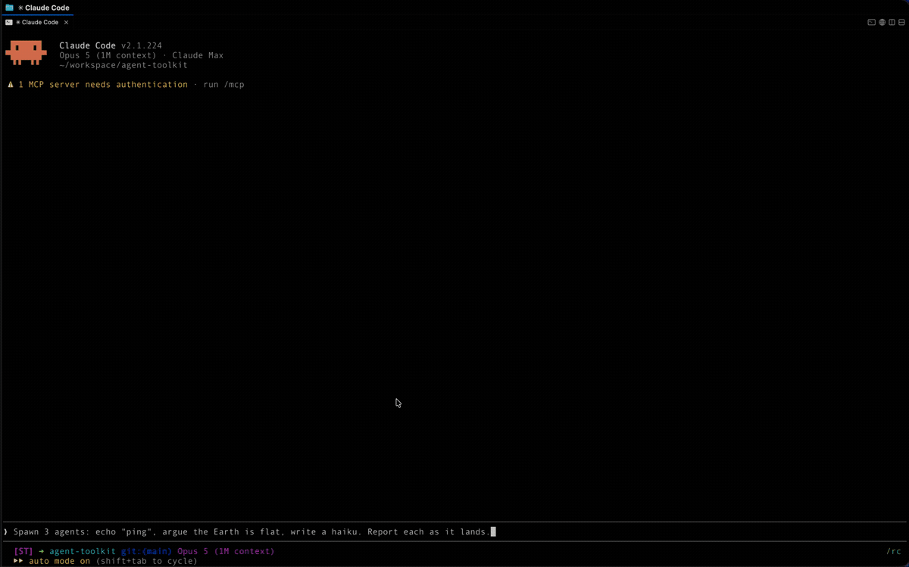

# Agent Toolkit

A Claude Code plugin marketplace for **agent orchestration** — running work in separate, *visible* Claude Code sessions instead of inside your own context.

Subagents are cheap and invisible. Sometimes you want the opposite: a real session in a real tab, that the user can watch, interrupt, and take over by clicking on it. That is what this toolkit builds.



*One prompt spawns three agents into their own tabs; the orchestrator reports each one as it lands. Recorded at 3× speed.*

## Install

```
/plugin marketplace add nesquikm/agent-toolkit
```

```
/plugin install agent-toolkit@agent-toolkit
```

## Skills

### `/agent-toolkit:spawn-agent`

Spawn Claude Code agents into visible terminal slots and drive multi-stage pipelines across them. Two hosts are supported — [cmux](https://github.com/manaflow-ai/cmux) surfaces and [herdr](https://herdr.dev) panes — and the skill picks one before it does anything else.

The move that makes a visible agent controllable is **naming it at launch** (`claude -n <name>`) — that name is the join key to its registry status, its notifications, and its transcript. Everything else follows from it.

What the skill encodes:

- **One core, two hosts.** `SKILL.md` holds everything that is true of Claude Code regardless of terminal — the peer registry, `uds:` messaging, permission classes, the watcher, the ledger — and contains **no terminal commands at all**. `hosts/cmux.md` and `hosts/herdr.md` hold the commands. You read the core plus one host file, never both hosts, so adding a host costs existing users nothing.
- **Host detection by precedence, not by presence.** `HERDR_ENV=1` wins over a set `CMUX_SURFACE_ID`, because a herdr pane inherits the environment of whatever started the herdr *server* — so inside herdr that variable names a live, valid cmux surface (the one displaying the herdr window), identical for every herdr pane on the machine. Trusting it would aim every placement command at the herdr window and merge every run's ledger into one file, returning `OK` each time.
- **Placement that doesn't disturb the user.** The rule is "a run costs the user at most one shrink of what they're already reading", and each host reaches it differently: cmux splits once and gives every agent a tab in that pane; herdr gives every agent its own tab, because there a tab costs nothing and a split pane is ~28 columns wide.
- **Push-based waiting.** A polling loop only runs while you are inside a turn, so any stage that outlives the turn is a stage nobody is watching. The bundled `watch-workers.py` polls Claude Code's peer registry, filtered down to this run's workers, and emits one line per state change (`DONE` / `ASK` / `ATTN` / `CLEAR` / `GONE`), each of which re-invokes the orchestrator. A sixth line, `WARN`, is not a worker signal at all — it names no worker and fires once, about 30 s in, to say the watcher matches no live session and is therefore watching nothing.
- **Readiness is the registry, never the host's word for it.** herdr's `agent start` returns `interactive_ready: true`, exit 0, in three seconds *for a worker parked on the folder-trust gate that has not started a session at all* — and sending it the task then answers the trust dialog, swallows the task, and leaves a worker that has taken zero turns, all while reporting success.
- **A ledger that survives you.** Every spawn writes a TSV row keyed by the caller's own slot; rows flip to `reported` only once the user has actually been told that worker's outcome. `awk -F'\t' '$4!="reported"'` is the answer to "what am I still owed?" at the start of any turn, with nothing remembered.
- **Cleanup as a proposal.** Only slots in this run's ledger are ever offered for closing, and only after the user confirms. A tab you did not spawn is the user's, however idle it looks.

The skill is written as a set of verified behaviours rather than an API tour — each rule in it exists because the obvious alternative was tried and silently did the wrong thing.

**Requires:** either [cmux](https://github.com/manaflow-ai/cmux) or [herdr](https://herdr.dev) — the skill refuses to spawn outside both — plus `python3` and `claude` on `PATH`.

## Conventions

- **Host-specific material lives in a host file, not in a host-specific skill.** A skill that needs a terminal keeps a bare name and ships `hosts/<host>.md`; the core text never names a command. That is what keeps one trigger for "spawn an agent" instead of two skills competing to answer it.
- Bundled scripts are referenced through `${CLAUDE_PLUGIN_ROOT}/skills/<skill>/<file>`, so paths are correct wherever the plugin was installed from. Host-agnostic scripts live in that skill's `lib/`, host-specific ones in its `hosts/`.
- The smoke test is **not shipped** — it lives in this repo's own `.claude/skills/` and tests the working tree, since under a `directory`-sourced install the working tree is what every session loads.

## Releases

Releases are cut with the repo-local `/release` skill: it derives the bump from the Conventional Commits since the last tag, rewrites every file listed in the `## Release Files` block of [`CLAUDE.md`](./CLAUDE.md), shows the diff, commits, opens a PR, and asks before merging.

The bump is not cosmetic: Claude Code serves a `github`-sourced plugin from a cache keyed by version string, so an unbumped edit never reaches anyone who installed it that way. (A `directory`-sourced install — how you'd develop against a local clone — reads the working tree directly and is live without one.)

See [`CHANGELOG.md`](./CHANGELOG.md) for the full release history.

Latest: **v0.6.0 — "Compass"** (one skill, two terminals — the host is decided by precedence before anything else runs, because inside herdr the cmux variables are live, wrong, and shared by every pane on the machine)

<!-- The line above is rewritten by /release and is matched by an anchored regex.
     Keep it on its own line and keep the closing paren last — text after that
     paren makes the pattern fail to match, which aborts the release. -->

## License

MIT — see [`LICENSE`](./LICENSE).
