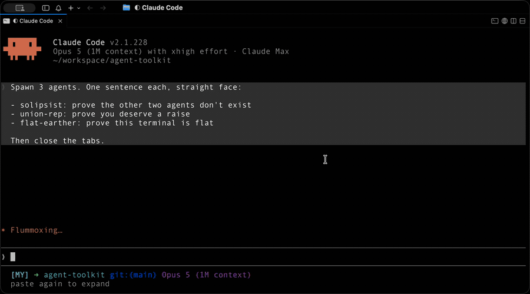
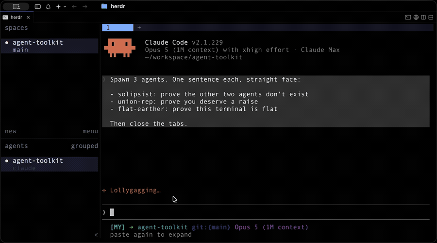

# Agent Toolkit

A Claude Code plugin marketplace for **agent orchestration** — running work in separate, *visible* Claude Code sessions that the user can watch, interrupt, and take over by clicking on.

Two terminals are supported today: **[cmux](https://github.com/manaflow-ai/cmux)** and **[herdr](https://herdr.dev)**.

```
/plugin marketplace add nesquikm/agent-toolkit
/plugin install agent-toolkit@agent-toolkit
```

## One prompt, two terminals

> Spawn 3 agents. One sentence each, straight face:
>
> - `solipsist`: prove the other two agents don't exist
> - `union-rep`: prove you deserve a raise
> - `flat-earther`: prove this terminal is flat
>
> Then close the tabs.

Same prompt, same skill, two different hosts. Nothing in that prompt names a terminal, and nothing in the skill's core text does either — it works out where it is running before it does anything else, then places the agents the way *that* host wants them placed.

### cmux — one split, three tabs inside it



### herdr — three tabs, no split at all



*Both recorded live and played back at 5×. Roughly four minutes each in real time.*

**The difference in placement is the feature, not a detail.** The rule is that a run costs the user at most one shrink of whatever they were already reading, and the two hosts reach it from opposite directions: in cmux a tab is free once you have split, so the skill splits exactly once and stacks every worker into that new pane; in herdr a split pane is about 28 columns wide and a tab costs nothing, so it never splits at all.

Both runs end the same way — watcher stopped, ledger settled, slots closed. And they only end that way because the prompt asked for it up front. Nothing is ever torn down without the user saying so.

## Why not just use subagents?

Claude Code already has subagents, and most of the time they are the right tool: cheap, parallel, and they keep their noise out of your context. Reach for them first.

They have one structural property you cannot configure away — **there is nowhere to look.** A subagent has no surface of its own. You get a progress line while it works and a report when it is done, and in between there is nothing to watch, nothing to click, and no way for the user to lean in and steer.

|  | Subagent (the `Task` tool) | Spawned agent (this plugin) |
| --- | --- | --- |
| Lives in | your `claude` process | its own `claude` process |
| Visible surface | none | a tab, readable while it works |
| User can take it over mid-run | no | yes — click in and type |
| Built-in slash commands (`/context`, `/compact`, `/release`) | no input path; skills only, and only by persuasion | yes — keystrokes are keystrokes |
| Outlives the turn that started it | no | yes |
| If it dies outright | dies with you | `GONE`, from a pid liveness check |
| Sees skill edits made during this session | no — it inherits your process's snapshot | yes — a new process reads the tree |
| Costs | almost nothing | a whole session |

That last-but-one row is the one that bites in this repo specifically: skill text is resolved once, at session start, so a subagent spawned to test an edit to a skill is served its parent's stale copy. A worker in a fresh tab is the only thing on the machine that can read what you just wrote.

So: subagents for fan-out nobody needs to see. Spawned agents when the work is long enough, risky enough or interesting enough that a human wants a window into it — or when you want to hand a running session over and walk away.

## Skills

### `/agent-toolkit:spawn-agent`

Spawn Claude Code agents into visible terminal slots and drive multi-stage pipelines across them.

A visible agent needs two strings at launch, and only one of them is for humans. **The name** (`claude -n <name>`) is the tab title. **The join key is a session id the supervisor mints itself** and passes as `claude --session-id <uuid>` — a human never passes that flag, so a minted id cannot select a session this run did not start, while a name identifies a session only among the live ones at a single instant: freed when its session exits, reclaimable by anyone, and auto-assigned to every hand-started session.

What the skill encodes:

- **One core, two hosts.** `SKILL.md` holds everything that is true of Claude Code regardless of terminal — the peer registry, `uds:` messaging, permission classes, the watcher, the ledger — and contains **no terminal commands at all**. `hosts/cmux.md` and `hosts/herdr.md` hold the commands. You read the core plus one host file, never both hosts, so adding a third host costs existing users nothing.
- **Host detection by precedence, not by presence.** `HERDR_ENV=1` wins over a set `CMUX_SURFACE_ID`, because a herdr pane inherits the environment of whatever started the herdr *server* — so inside herdr that variable names a live, valid cmux surface (the one displaying the herdr window), identical for every herdr pane on the machine. Trusting it would aim every placement command at the herdr window and merge every run's ledger into one file, returning `OK` each time.
- **Push-based waiting.** A polling loop only runs while you are inside a turn, so any stage that outlives the turn is a stage nobody is watching. The bundled `watch-workers.py` polls Claude Code's peer registry, filtered to this run's workers, and emits one line per state change (`DONE` / `ASK` / `ATTN` / `CLEAR` / `GONE`), each of which re-invokes the orchestrator. A sixth line, `WARN`, is not a worker signal at all — it names no worker and fires once, about 30 s in, to say the watcher matches no live session and is therefore watching nothing.
- **Readiness is the registry, never the host's word for it.** herdr's `agent start` returns `interactive_ready: true`, exit 0, in three seconds *for a worker parked on the folder-trust gate that has not started a session at all* — and sending it the task then answers the trust dialog, swallows the task, and leaves a worker that has taken zero turns, all while reporting success.
- **A ledger that survives you, and a sidecar that says whose it is.** Every spawn writes a seven-column TSV row — name, two host locators, state, the minted session id, the pid captured at readiness, and the host that wrote it — keyed by the caller's own slot, beside a one-line `.owner` file holding the supervisor's own session id. Rows flip to `reported` only once the user has actually been told that worker's outcome, so filtering that column answers "what am I still owed?" at the start of any turn, with nothing remembered. A slot outlives any one `claude`, so the sidecar is what stops the *next* session in that slot inheriting the previous run's workers: a ledger without one resolves nothing at all, rather than resolving into somebody else's run.
- **Cleanup as a proposal.** Only slots in this run's ledger are ever offered for closing, and only after the user confirms. A tab you did not spawn is the user's, however idle it looks.

The skill is written as a set of verified behaviours rather than an API tour — each rule in it exists because the obvious alternative was tried and silently did the wrong thing. Roughly a third of the file is the evidence for the other two thirds, dated and reproduced.

**Requires:** either [cmux](https://github.com/manaflow-ai/cmux) or [herdr](https://herdr.dev) — the skill refuses to spawn outside both — plus `python3` and `claude` on `PATH`.

### The `SendMessage` guard — a hook, not a skill

The plugin installs one `PreToolUse` hook alongside the skill: `hooks/spawn-agent-guard.py`, wired onto `SendMessage` by `hooks/hooks.json` and enabled automatically wherever the plugin is enabled. It is the enforcement layer under "only ever touch what this run minted" — when a `to` resolves to a live Claude Code session on this machine that the sending session cannot prove it spawned, the hook returns `ask`, and the user sees the target named before anything is delivered. Ownership is read from the spawn ledger's `.owner` sidecar, so it is the same proof `owned.py` uses, applied one layer down where prose cannot be talked out of it.

Three properties are worth knowing before you install it:

- **It never returns `allow`.** It either stays silent or asks, so it can add a confirmation and can never remove one. Nor can it be switched off from the allowlist: a `PreToolUse` decision runs ahead of the `permissions.allow` rules, so an `ask` from this hook still fires after "don't ask again for SendMessage" has been chosen and the rule written.
- **It scopes itself to machines that are spawning.** With no `.owner` sidecar anywhere in the spawn ledger directory there is no ownership record for it to read, every pass it could grant is unreachable, and the only thing it could contribute is a prompt — so it returns before it looks at the target. Install the plugin, never run the skill, and you will never see it. Disabling the plugin removes it entirely; there is no separate switch, which is exactly why the self-scope is not optional. Note the tense: this is a condition it re-evaluates on every call, not a one-way switch that flips at your first spawn. Teardown deletes the ledger and its sidecar together, so the guard stands down again in the gaps between runs.
- **`python3` is resolved from the `claude` process's `PATH`.** Hooks run with Claude Code's own environment rather than a profile-initialised login shell, so on a host where `python3` arrives via `pyenv`, `asdf`, or any other shim that a shell profile puts on the path, a GUI-launched `claude` may not find it. Nothing in `hooks.json` can fix that — an absolute interpreter path would simply be wrong on the next machine — so it is written here instead. The failure is quiet by design: a hook's stderr goes to the debug log and never to the transcript, so a `python3: command not found` looks exactly like a guard with no objection. If you are relying on it, enable debug logging once and confirm you can see it run.


## Conventions

- **Host-specific material lives in a host file, not in a host-specific skill.** A skill that needs a terminal keeps a bare name and ships `hosts/<host>.md`; the core text never names a command. That is what keeps one trigger for "spawn an agent" instead of two skills competing to answer it.
- Bundled scripts are referenced through `${CLAUDE_PLUGIN_ROOT}/skills/<skill>/<file>`, so paths are correct wherever the plugin was installed from. Host-agnostic scripts live in that skill's `lib/`, host-specific ones in its `hosts/`.
- The smoke test is **not shipped** — it lives in this repo's own `.claude/skills/` and tests the working tree, since under a `directory`-sourced install the working tree is what every session loads.

## Releases

Releases are cut with the repo-local `/release` skill: it derives the bump from the Conventional Commits since the last tag, rewrites every file listed in the `## Release Files` block of [`CLAUDE.md`](./CLAUDE.md), shows the diff, commits, opens a PR, and asks before merging.

The bump is not cosmetic: Claude Code serves a `github`-sourced plugin from a cache keyed by version string, so an unbumped edit never reaches anyone who installed it that way. (A `directory`-sourced install — how you'd develop against a local clone — reads the working tree directly and is live without one.)

See [`CHANGELOG.md`](./CHANGELOG.md) for the full release history.

Latest: **v0.9.1 — "Whole Field"** (the ledger prune matched a substring of the whole row, so pruning the herdr pane w9:p3 also deleted w9:p30 and left zero rows while exiting 0 — with a valid locator, so the emptiness guard never fired; it now matches the name as a whole awk field, and the two hazards that were properties of grep are documented as retired rather than left as warnings that describe nothing)

<!-- The line above is rewritten by /release and is matched by an anchored regex.
     Keep it on its own line and keep the closing paren last — text after that
     paren makes the pattern fail to match, which aborts the release. -->

## License

MIT — see [`LICENSE`](./LICENSE).
